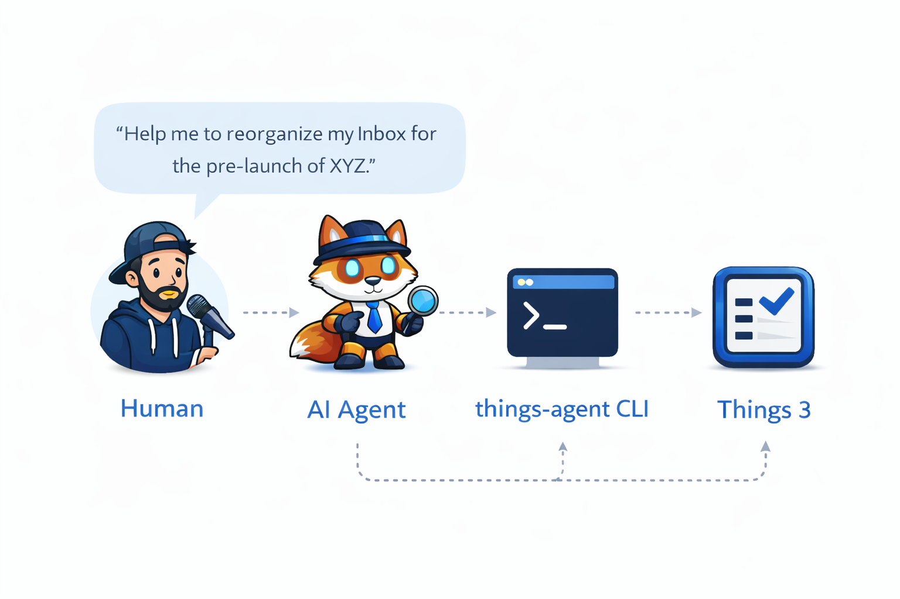

# things-agent

[](https://pkg.go.dev/github.com/alnah/things-agent)
[](https://goreportcard.com/report/github.com/alnah/things-agent)
[](https://github.com/alnah/things-agent/actions/workflows/ci.yml)
[](https://codecov.io/gh/alnah/things-agent)
[](./LICENSE)

> AI-first operational bridge for Things 3 on macOS. It gives an AI agent a constrained CLI over Things' existing automation surfaces: AppleScript, the official Things URL Scheme, and a narrowly scoped internal SQLite restore harness used only for restore workflows.



Independent project. Not affiliated with Cultured Code.

Documentation split:

- `README.md`: user-facing guide for the human who asks an AI coding agent such as Codex, Claude Code, Open Code, or similar tools to manage Things through the CLI.
- [`AGENTS.md`](./AGENTS.md): operator contract for the AI agent that actually runs the CLI.

## Table of contents

- [Why this exists](#why-this-exists)
- [What it does](#what-it-does)
- [Opportunity](#opportunity)
- [Project status](#project-status)
- [Installation](#installation)
- [Prerequisites](#prerequisites)
- [Interaction model](#interaction-model)
- [Design constraints](#design-constraints)
- [Using with Codex, Claude Code, Open Code, etc.](#using-with-codex-claude-code-open-code-etc)
- [Domain glossary](#domain-glossary)
- [Known limits](#known-limits)
- [Backup policy](#backup-policy)
- [Common workflows](#common-workflows)
- [Troubleshooting](#troubleshooting)
- [Security warning read before use](#security-warning-read-before-use)
- [CI and coverage](#ci-and-coverage)

## Why this exists

Things already exposes useful automation surfaces, but AI agents benefit from a narrower operational layer with explicit commands, machine-readable outputs, and safer recovery workflows than ad hoc scripts.

This project is built for the practical path:

`Human intent > AI agent > things-agent CLI > Things 3`

Normal reads and writes stay on top of AppleScript and the official Things URL Scheme.
Internal SQLite work is reserved for restore only.

## What it does

- reads Things state in text or JSON forms that an AI agent can use reliably
- creates, edits, moves, completes, and deletes areas, projects, tasks, checklist items, and child tasks
- adds backup, restore, preflight, and verification flows for higher-risk operations
- keeps direct database access out of normal agent-authored operations

## Opportunity

Things already exposes solid official local automation surfaces through [AppleScript](https://culturedcode.com/things/download/Things3AppleScriptGuide.pdf), the [Things URL Scheme](https://culturedcode.com/things/support/articles/2803573/), and [Apple Shortcuts](https://culturedcode.com/things/help/shortcuts-actions/). This project explores what becomes possible when those surfaces are wrapped in a stricter operational layer for AI agents.

The idea is not to criticize Things or bypass the app's model.
The opportunity is to show that:

- Things is already a strong local automation base for agent-driven workflows
- a constrained CLI can make those workflows more explicit, verifiable, and safer to operate
- if there were ever an official CLI with full app coverage, it could become a clean foundation for an MCP server or other agent-facing runtimes

That would keep the center of gravity where it belongs: on official app behavior, official capabilities, and a safer contract between human intent, automation, and Things itself.

## Project status

- This project is primarily meant to be consumed by an AI agent, not used as a polished human-first CLI.
- It is already useful in practice for organizing Things through AI, including voice-driven workflows.
- It includes safety rails, backup/restore workflows, and verification steps, but it is not fully hardened.
- The user still takes real risk and will likely need to grant system permissions for the setup to work reliably.

## Installation

Install from tags (recommended):

```bash
go install github.com/alnah/things-agent@latest
```

Install the unstable version (latest `main`):

```bash
go install github.com/alnah/things-agent@latest
```

Version behavior:

- builds installed from `@main` report `dev` (or `dev (<commit>)` when VCS build info is available)
- builds installed from a release tag report that tagged version
- release archives inject the tagged version at build time

Releases are built from `v*` tags with GoReleaser.

## Prerequisites

- macOS
- Things app installed
- `osascript`

Agents must never touch the Things database directly.
Some native checklist operations (URL scheme `update`) require a Things auth token (`THINGS_AUTH_TOKEN` or `--auth-token`).
Things uses both user areas and built-in lists (`Inbox`, `Today`, `Logbook`, etc.); this CLI uses `area` for the area entity and keeps `list` only for generic Things list filters and official URL parameters.
For token, permissions, and list-locale errors, see [Troubleshooting](#troubleshooting).

## Interaction model

The primary model is:

`Human > AI agent > things-agent CLI > Things 3`

This repository is not trying to turn Things into a general-purpose shell app for direct human use.
The main goal is to give an AI agent a constrained operational bridge to read and change Things state with clearer semantics and some safety controls.

In practice, this means:

- the human expresses intent in natural language
- the AI agent translates that intent into `things-agent` commands
- the CLI uses AppleScript and the Things URL Scheme to operate Things 3
- backup, restore, and verification flows try to reduce risk, but do not remove it

## Design constraints

- normal operations use Things automation surfaces rather than direct database access
- restore is the only place where the project uses a narrowly scoped internal SQLite step
- the CLI is designed to be explicit enough for an AI agent to execute and verify safely
- permissions, local machine policy, and user trust still matter

## Using with Codex, Claude Code, Open Code, etc.

Use this checklist before asking an AI agent to manage Things for you:

```bash
git clone https://github.com/alnah/things-agent.git
cd things-agent

go install github.com/alnah/things-agent@main
# optional runtime env (example for French Things setup)
export THINGS_DEFAULT_LIST="À classer"

# required for URL update/checklist operations
export THINGS_AUTH_TOKEN="<your-things-token>"

# keep one instruction source for Codex, Claude Code, Open Code, etc.
ln -sf AGENTS.md CLAUDE.md

# quick health check
things-agent version
things-agent --help
```

You usually do not need to drive the CLI manually beyond setup, debugging, or recovery.
The normal path is to let the AI agent read `AGENTS.md`, inspect `things-agent --help`, and then operate Things through the CLI.

## Domain glossary

Use these terms when talking to the agent. They match the CLI's high-level model from `things-agent --help`.

| Term             | Meaning                                                                                                                                                                                                                              | Language alternatives                                                                    |
| ---------------- | ------------------------------------------------------------------------------------------------------------------------------------------------------------------------------------------------------------------------------------ | ---------------------------------------------------------------------------------------- |
| `area`           | A user-managed Things area. High-level CRUD and move commands use `area`.                                                                                                                                                            | `domaine`, `aire`, `área`, `Bereich`                                                     |
| `list`           | A generic Things list name used for read filters and the official URL Scheme. This includes built-in lists such as `Inbox`, `Today`, `Logbook`, and `Archive`, plus area names where the Things API expects a generic list selector. | `liste`, `lista`, `Liste`                                                                |
| `project`        | A Things project.                                                                                                                                                                                                                    | `projet`, `proyecto`, `projeto`, `Projekt`, `progetto`                                   |
| `task`           | A top-level to-do.                                                                                                                                                                                                                   | `tâche`, `tarea`, `tarefa`, `Aufgabe`, `attività`                                        |
| `checklist item` | A lightweight native checklist line inside a task.                                                                                                                                                                                   | `élément de checklist`, `elemento de checklist`, `item de checklist`, `Checklistenpunkt` |
| `child task`     | A structured child to-do under a project.                                                                                                                                                                                            | `sous-tâche`, `subtarea`, `subtarefa`, `Unteraufgabe`, `sottoattività`                   |

When in doubt:

- say `area`, not `list`, for user-managed areas
- say `list` only for built-in Things lists or generic list filters
- say `checklist item` for native checklist lines inside a task
- say `child task` for structured project children
- the translated terms above are user-facing equivalents for talking to the agent, not guaranteed official Things UI labels in every locale

## Known limits

### Reorder

- Reorder support is partial and uses unstable Things internals.
- `reorder-area-items` cannot freely interleave projects and tasks inside an area; Things still keeps projects before tasks.
- No stable public backend exists yet for checklist-item reorder, heading reorder, or sidebar area reorder.

### Headings

- Headings are still manual.
- Runtime validation showed that `things:///json` project updates did not create visible headings, private JSON read paths did not expose headings, and `move-task --to-heading` or `--to-heading-id` may return `ok` even when nothing changes.
- Create headings in Things, then return to the CLI for everything else.

### Recurring tasks

- Recurring tasks are not automated yet.
- Public AppleScript and URL Scheme docs do not expose a reliable recurrence create/update path.
- Create or edit recurring tasks manually in Things.

### Restore

- Restore works when Things stays offline for the first launch after the restore.
- In practice, use the CLI's offline restore mode so the restored snapshot is not immediately overwritten by sync state.
- After restore, verify the data first. If you use Things Cloud, re-enable it manually only after verification.

## Backup policy

The CLI uses one backup artifact format: an official Things package snapshot stored in `ThingsData-*/Backups`. The distinction is in the backup `kind`, not in the snapshot format.

- `session`: created by `things-agent session-start`; the automatic checkpoint at the start of an agent session.
- `explicit`: created by `things-agent backup`; the main user-facing restore checkpoint.
- `safety`: created automatically before critical operations such as `restore`; mainly for rollback.

Each snapshot also gets a small JSON index file (`timestamp`, `kind`, `created_at`, `source_command`, `reason`, `complete`, `files`); `safety` backups are for rollback/debugging, retention is shared across all kinds (50 snapshots total), and if Things was already open when a backup starts, the CLI reopens it afterward.

## Common workflows

Ask the AI agent in natural language, for example:

- "Show me what is in Today and Inbox."
- "Create a project in area Codebases and add three tasks."
- "Back up Things, then reorganize these tasks."
- "Restore the snapshot from the last timestamp."
- "Search for tasks about invoices."

## Troubleshooting

### Permissions

If AppleScript calls fail or the CLI cannot control Things, validate the environment first:

```bash
osascript -e 'tell application id "com.culturedcode.ThingsMac" to get name'
things-agent version
things-agent lists
```

Then re-check macOS privacy settings for your terminal/agent app:

- `System Settings > Privacy & Security > Automation` (allow access to `Things`)
- `System Settings > Privacy & Security > Full Disk Access` (if your setup requires it)

In practice, agents often get better results when their tool runner is configured with broader filesystem, shell, or bypass-style permission modes.
That also gives the agent broader access to your system, so keep an eye on what it is doing and review risky actions carefully.

### Auth token (`THINGS_AUTH_TOKEN`)

Native checklist updates require a valid token (`add-checklist-item`, `url update`, `add-task --checklist-items`).
If you see missing or invalid token errors:

```bash
export THINGS_AUTH_TOKEN="<your-things-token>"
things-agent add-task --name "Token check" --area "Inbox" --checklist-items "one, two"
```

You can also pass `--auth-token` explicitly per command.

### Localized list names

Things list names are localized (`Inbox`, `À classer`, etc.). If `--list` looks wrong or returns no results:

```bash
things-agent lists
export THINGS_DEFAULT_LIST="À classer"
things-agent tasks --list "À classer"
```

## Security warning read before use

Use this project at your own risk.

### Agent risk model

- To be useful, AI agents often need broad system permissions.
- Agents can bypass expectations or instructions if they are sufficiently capable.
- This repository includes safety rails, but it does not provide a full safety guarantee for end users.
- You remain fully responsible for what the agent executes on your machine.
- The user may need to grant Automation, filesystem, and related permissions before the bridge works reliably.

### Safety personal choice

- Deletion remains available item by item (`delete-task`, `delete-project`, `delete-area`).
- The agent starts each session with `session-start`, and the user can ask for extra backups before heavier or harder-to-reverse operations.
- Backups are rotated and capped at 50 snapshots; on the author's machine, the full `Backups/` folder uses roughly `316 MB`, but this varies with database size.
- `AGENTS.md` forbids direct SQLite access.
- Any bypass of CLI constraints requires an explicit user decision.

### Auth token handling

Do not expose your Things auth token to your AI provider unless strictly necessary.
Prefer resolving it locally from a secret store at runtime instead of hardcoding it in shell history, scripts, or repo files.

Get the token on macOS:

1. Open `Things 3`.
2. Go to `Things > Settings > General`.
3. In the `Things URLs` section, open token management and copy the auth token.
4. Export it in your shell:

```bash
export THINGS_AUTH_TOKEN="<your-token>"
```

A better approach is to keep the token in a local secret manager and resolve it only at runtime on your Mac.

Examples:

- macOS with `pass`:

```bash
export THINGS_AUTH_TOKEN="$(pass show things/auth-token)"
```

If you use `zsh`, you can put that line in `~/.zshrc` so every new terminal session gets the token automatically from your local password store.
This is often the simplest setup for individual use on macOS:

1. Store the token once in `pass`:

```bash
pass insert things/auth-token
```

2. Add this line to `~/.zshrc`:

```bash
export THINGS_AUTH_TOKEN="$(pass show things/auth-token)"
```

3. Reload your shell:

```bash
source ~/.zshrc
```

This keeps the token out of the repository and out of most day-to-day shell history, while still making it available to `things-agent`.

Other macOS-local secret managers such as Keychain, 1Password CLI, or Bitwarden CLI work too, as long as the token is resolved locally on the machine at runtime.

This reduces accidental exposure, but it is not a perfect guarantee. If an agent is allowed and motivated to exfiltrate secrets, it may still leak the token.

## CI and coverage

- `ci.yml` runs unit tests on each push/PR.
- It also runs mocked integration tests (`-tags=integration`) without direct DB access.
- Coverage is uploaded to Codecov from CI.
